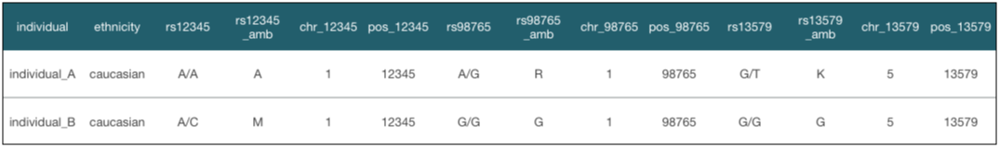
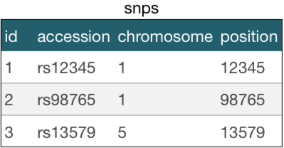

# I0U19A

Management of large-scale omics data

Prof Jan Aerts - Faculty of Engineering ESAT/STADIUS

- - - 

jan.aerts@esat.kuleuven.be - http://visualanalyticsleuven.be

Teaching assistants:

* Toni Verbeiren (toni.verbeiren@esat.kuleuven.be)
* Ryo Sakai (ryo.sakai@esat.kuleuven.be)
* Raf Winand (raf.winand@esat.kuleuven.be)

# Course overview

- - -

## Schedule

| Week | Date | Room | Type | Topic |
|------|------|------|------|-------|
| 1 | 13/2/2014 | LAND 91.30 | lecture | What is big data? |
| 2 | 20/2/2014 | LAND 91.30 | lecture | Visual Analytics |
| 3 | 27/2/2014 | LAND 91.30 | exercise | Visual Analytics |
| 4 | 6/3/2014 | no lecture	 | (SQL exercise)  |  |
| 5 | 13/3/2014 | LAND 91.30 | lecture | Lambda Architecture |
| 6 | 20/3/2014 | LAND 91.30 | lecture | Data processing |
| 7 | 27/3/2014 | LAND 91.30 | exercise | Data processing |
| 8 | 3/4/2014 | no lecture |  |  |
| 9 | 24/4/2014 | LAND 00.210 | lecture | Document and graph databases |
| 10 | 8/5/2014 | LAND 00.210 | exercise | Document databases |
| 11 | 15/5/2015 | LAND 00.210 | exercise | Graph databases |
| 12 | 22/5/2014 | LAND 00.210 | exam | |

## Exercises

Three datasets:

* genotypes
* beers in Belgium
* approved drugs

 
Modeled and stored using different database technologies => which technology (or combination of technologies) fits a particular dataset (and its intended use) best?

Preparation of exercise session: assignment including e.g. modelling of data => answers will be used in exercise session

## Evaluation

Combination of:

* permanent evaluation (including preparation of exercise sessions): 10%
* take-home data visualization assignment: 10%
* open-book written exam: 80%

 
At least 8/20 for each.

## Interesting books

* Marz N & Warren J (2013). Big Data. Manning Publications.
* McCreary D & Kelly A (2013). Making Sense of NoSQL. Manning Publications.
* Wood D, Zaidman M & Ruth L (2013). Linked Data. Manning Publications.

## Your background

* scripting?
* SQL?

## Today - What is big data?

## What is big data?

How would *you* describe "big data"? Can you give examples?

## Some examples

* **Netflix** - analysis of traffic patterns across device types to improve reliability of video streaming; recommendation engine based on viewing habits
* **Politics: project "Narwhal"** - Obama campaign operations: don't knock on door of people who have already volunteered, don't send email asking for money to people who already contributed
* **WeatherSignal** - repurposes sensors in Android smartphones to map atmospheric readings (barometer, hygrometer, ambient thermometer, light meter)
* **Retail (Target)** - predict future purchasing habits (e.g. pregnancy) => targeted ads

## Why are these examples different?

* Data collection is easy
* Data is often unstructured
* Data can be used for many things

 
Example datasets available at http://www.datasciencecentral.com/profiles/blogs/big-data-sets-available-for-free

## Big data - the bigger picture

"Fourth Paradigm" of scientific research (Jim Grey, Microsoft)

|     |                  |                  |                                      |
|:----|:-----------------|:-----------------|:-------------------------------------|
| 1st | 1,000s years ago | empirical        | describing natural phenomena         |
| 2nd | 100s years ago   | theoretical      | theoretical "laws" (Kepler, Newton) |
| 3rd | last few decades | computational    | modeling, simulation                 |
| 4rd | today            | data exploration | data processing                      |

## Some terms you might encounter

* OLTP = On Line Transaction Processing (*batch layer*)
* OLAP = On Line Analytic Processing (*serving layer*)

	OLTP	OLAP
application	operational	analysis
refresh	immediate	periodic
data model	entity-relationship	multi-dimensional
schema	normalized	star
emphasis	update	retrieval

## Some factors playing a role in working with (big) data

* **Data collection** - is the easy part. Every individual is not only a data collector but also generator (clicks, comments on Facebook, ...)
 * Some restrictions might apply, e.g. more difficult to get patient data, potentially identifiable information, ...
* **Ingesting and cleaning** (a.k.a. ETL: Extract-Transform-Load) - putting the right data in the right column in the right format
 * big data: often unstructured data => how does this fit in a relational database?
 * = 80% of effort in data collection
 * OpenRefine - www.openrefine.org

* **Hardware** - With big data: still need storage, processing and network. But it changes how these are used (e.g. virtualization, cloud computing)
* **Platforms** - When big data need to be processed we will often try to speed this up using parallelization. Still: not fast enough if (1) we’re working in an interactive user interface, or (2) we want to analyze unstructured data iteratively
* **Human exploration** - While machine learning is an important tool in data analysis, there’s no substitute for human eyes => with big data: stretching the limits of multi-dimensional visualization
* **Storage** - raw data + transformed data + virtual machines to analyze the data + analysis results + legacy formats; mix: cloud + on-premise storage

## What is big data?

* big data = data that exceeds processing capacity of conventional database systems (too big, moves too fast, doesn’t fit in database structure)
* Being able to process every item of data in reasonable time removes the troublesome need for sampling
* Necessary counterpart: agility - successful exploitation of big data requires experimentation and exploration
* Because it’s big: bring computation to the data instead of the data to the computation

 
*Different way of thinking*

## The Three V's

### 1. Volume ###

* most immediate challenge to conventional IT structures; principle of big data: *if you can, keep everything*
* need scalable storage + distributed querying
* structured vs unstructured data -> Hadoop: MapReduce + HDFS
 * MapReduce: map = distributing a dataset among multiple servers and operating on the data; reduce = recombining the partial results
 * HDFS = Hadoop Distributed File System
 * Hadoop: for batch jobs (not interactive)

### 2. Variety ###

*Data is messy*

* 80% of effort in dealing with data = cleaning up
* process of moving from source data to processed application data involves loss of information
* relational databases: not always best destination for the data, even when tidied up (network data -> graph database; XML data -> dedicated XML store; ...)
* disadvantage of relational database: fixed schema <=> results of computations will evolve with detection and extraction of more signals
=> semi-structured NoSQL databases provide this flexibility: provide enough structure to organize data but do not require the exact schema of the data before storing it

### 3. Velocity ###

* increasing rate at which data flows into an organization, but also of system’s output
* origins: (1) velocity of incoming data; (2) speed of taking data from input through to decision
* often not possible to simple wait for a report to run or Hadoop job to complete
* streaming: important to consider, because (1) if input data too fast to store in its entirety (e.g. Large Hedron Collider @ CERN); (2) application might mandate immediate response to the data
* => need for speed (--> has driven development of key-value stores and columnar databases)

## Why do relational databases break down with big datasets? ##

## Normal forms

