# I0U19A - Management of large-scale omics data
Prof Jan Aerts (jan.aerts@kuleuven.be) 
Visual Data Analysis Lab, STADIUS/ESAT, KU Leuven 
http://vda-lab.be/teaching/i0u19a

TA: Thomas Moerman (thomas.moerman@kuleuven.be)

#### Overview of this course

#### Schedule
| Week</small> | <small>Date</small> | <small>Room</small> | <small>Type</small> | <small>Topic</small> |
|:-----|:-----|:-----|:-----|:------|
| <small>1</small> | <small>12/02/2015</small> | <small>200C 01.01 (PC class D)</small> | <small>lecture</small> | <small>What is big data?</small> |
| <small>2</small> | <small>19/02/2015</small> | <small>200C 01.01 (PC class D)</small> | <small>lecture</small> | <small>Visual data analysis</small> |
| <small>3</small> | <small>26/02/2015</small> | <small>200C 01-01 (PC class D)</small> | <small>exercise</small> | <small>Visual Data Analysis</small> |
| <small>4</small> | <small>05/03/2015</small> | <small>200C 01-01 (PC class D)</small> | <small>lecture</small> | <small>Lambda Architecture</small> |
| <small>5</small> | <small>12/03/2015</small> | <small>200C 01-01 (PC class D)</small> | <small>lecture</small> | <small>Data processing</small> |
| <small>6</small> | <small>19/03/2015</small> | <small>200C 01-01 (PC class D)</small> | <small>exercise</small> | <small>Data processing</small> |
| <small>7</small> | <small>26/03/2015</small> | <small>no lecture</small> | <small></small> | <small></small> |
| <small>8</small> | <small>02/04/2015</small> | <small>no lecture</small> | <small></small> | <small></small> |
| <small>9</small> | <small>23/04/2015</small> | <small>LAND 00.210</small> | <small>lecture</small> | <small>Document and graph databases</small> |
| <small>10</small> | <small>30/04/2015</small> | <small>LAND 00.210</small> | <small>exercise</small> | <small>Document databases</small> |
| <small>11</small> | <small>07/05/2015</small> | <small>LAND 00.210</small> | <small>exercise</small> | <small>Graph databases</small> |
| <small>12</small> | <small>21/05/2015</small> | <small>LAND 00.210</small> | <small>exam</small> | <small></small> |

#### Exercises and Assignments
Three datasets

* genotypes
* beers in Belgium
* approved drugs

Modelled and stored using different database technologies 
=> which technology (or combination of technologies) fits a particular dataset (and its intended use) best?

Preparation of exercise session: **assignment** including e.g. modelling of data => answers will be used in exercise session

#### Website
[http://vda-lab.be/teaching/i0u19a](http://vda-lab.be/teaching/i0u19a)

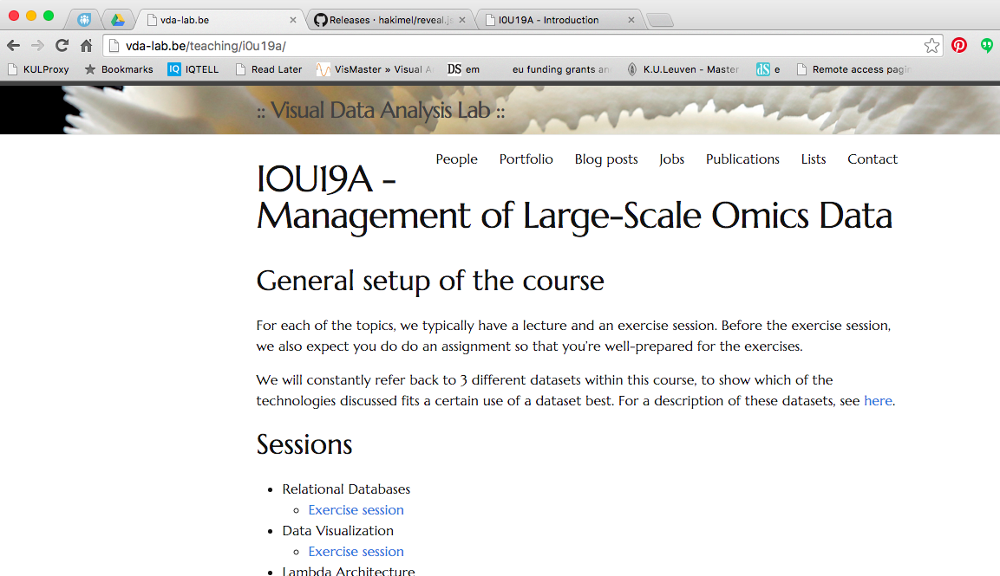

#### Evaluation
Combination of:

* permanent evaluation (including preparation of exercise sessions): 10%
* take-home data visualization assignment: 20%
* open-book written exam: 70%

At least 8/20 for each.

#### Books
* Marz N & Warren J (2013). *Big Data*. Manning Publications.
* McCreary D & Kelly A (2013). *Making Sense of NoSQL*. Manning Publications.
* Wood D, Zaidman M & Ruth L (2013). *Linked Data*. Manning Publications.

#### Your background
Scripting?

SQL?

#### Today - What is big data?
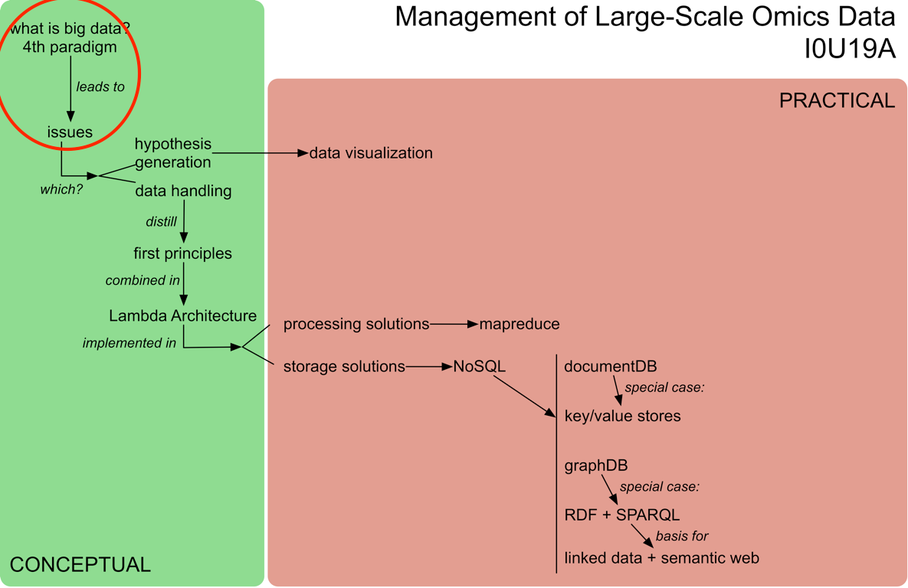

## What is big data?
How would *you* describe "big data"? Can you give examples?

#### Some examples
* Netflix
  * analysis of traffic patterns across device types to improve reliability of video streaming
  * recommendation engine based on viewing habits
* Politics - project "Narwhal"
  * Obama campaign operations: don't knock on door of people who have already volunteered, don't send email asking for money to people who already donated
* WeatherSignal
  * repurposes sensors in Android smartphones to map atmospheric readings (barometer, hygrometer, ambient thermometer, light meter)

* infectious diseases: Spatio-temporal Epidemiological Modeler STEM
  * IBM uses local climate and temperature to find correlations with hwo malaria spreads => used to predict location of future outbreaks
* Retail (Target)
  * predict future purchasing habits (e.g. pregnancy) => targeted ads

#### Why are these examples different?
* Data collection is easy
* Data is often unstructured
* Data can be used for many things

Example datasets available at [http://www.datasciencecentral.com/profiles/blogs/big-data-sets-available-for-free](http://www.datasciencecentral.com/profiles/blogs/big-data-sets-available-for-free)

### Big data - the bigger picture
Scientific research paradigms (Jim Gray, Microsoft)

| | | |
| --- | --- | --- |
| 1st | 1,000s years ago | observe, then derive |
| 2nd | 100s years ago | derive, then observe |
| 3rd | 10s years ago | simulate |
| 4rd | now | measure |

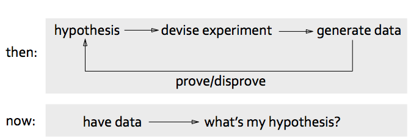

*Data analysis* 
moving from 
**hypothesis-first** 
to 
**data-first**

---

*Challenge* 
moving from  
**finding the right answer to a question** 
to 
**finding the right question given the data**

## What is big data?
big data = data that exceeds processing capacity of conventional database systems (too big, moves too fast, doesn't fit in database structure)

being able to process every item of data in reasonable time removes the troublesome need for sampling

necessary counterpart: *agility* - successful exploitation of big data requires experimentation and exploration

Because it's big: *bring computation to the data instead of the data to the computation*

*Different way of thinking*

#### The 3 V's
**Volume** - most immediate challenge to conventional IT structures; principle of big data: *if you can, keep everything*
* need *scalable storage* + *distributed querying*
* structured vs unstructured data

**Variety** - data is messy
* 80% of effort in dealing with data = cleaning up
* process of moving from source data to processed application data involves loss of information
* relational databases: not always best destination for the data, even when tidied up (e.g. network data)
* disadvantage of relational database: fixed schema <=> results of computations will evolve with detection and extraction of more signals => semi-structured NoSQL databases provide this flexibility: provide enough structure to organize data but do not require the exact schema of the data before storing it

**Velocity** - increasing rate at which data flows into an organization, but also of system output
* origins: (1) velocity of incoming data; (2) speed of taking data from input through to decision
* often not possible to simply wait for a report to run or Hadoop job to complete
* *streaming*: important to consider, because (1) if input data too fast to store in its entirety (e.g. Large Hedron Collider @ CERN); (2) application might mandate immediate response to the data

## RDBMS refresher
See [databases.html](databases.html)

## Why do relational databases break down with big data?

#### Normal forms

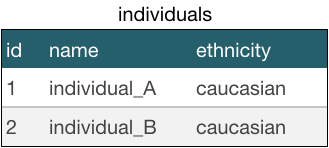

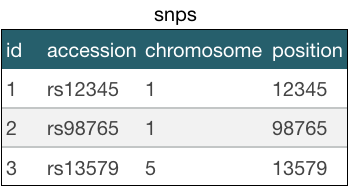

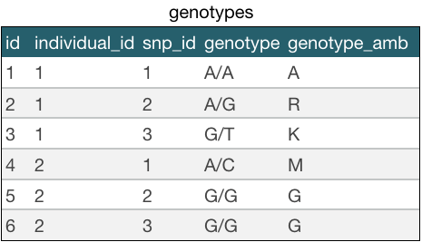

### 1. Querying scalability
Database schema normalization: every piece of information is stored only once

makes updating data easier and safe

requires less space(!)

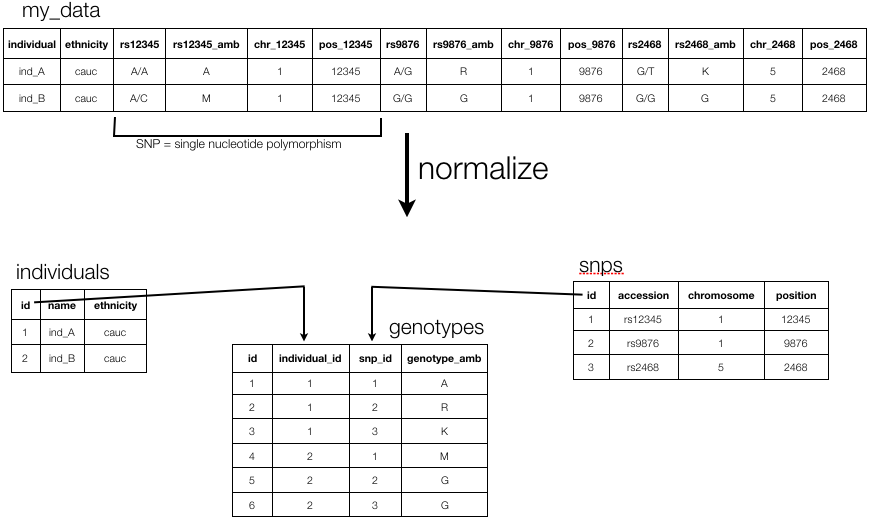

*advantage* of normalized database: you can ask any question

*disadvantage* of normalized database: to get an answer you will have to join tables => is expensive (i.e. becomes very (!) slow) if you have to combine many large tables (millions of rows)

e.g. return all names of individuals that have heterozygous SNPs on chromosome 1

    SELECT DISTINCT i.name
    FROM individuals i, snps s, genotypes g
    WHERE i.id = g.individual_id                    <== join
    AND s.id = g.snp_id                             <== join
    AND s.chromosome = 1
    AND g.genotype_amb NOT IN ('A','C','G','T');

Solution: **de-normalize**

e.g. getting exon positions for a gene in **Ensembl** (= normalized database; 74 tables):

`/usr/local/mysql/bin/mysql -u anonymous -h ensembldb.ensembl.org homo_sapiens_core_78_38`

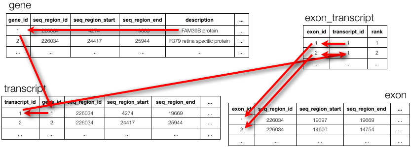

Query

    SELECT g.description, e.seq_region_start
    FROM gene g, transcript t, exon_transcript et, exon e
    WHERE g.gene_id = t.gene_id
    AND t.transcript_id = et.transcript_id
    AND et.exon_id = e.exon_id
    AND g.description LIKE 'FAM170B %'';

Answer

    +-------------------------------------------------------------+------------------+
    | description                                                 | seq_region_start |
    +-------------------------------------------------------------+------------------+
    | FAM170B antisense RNA 1 [Source:HGNC Symbol;Acc:HGNC:45006] |         49121839 |
    | FAM170B antisense RNA 1 [Source:HGNC Symbol;Acc:HGNC:45006] |         49135656 |
    | FAM170B antisense RNA 1 [Source:HGNC Symbol;Acc:HGNC:45006] |         49141253 |
    | FAM170B antisense RNA 1 [Source:HGNC Symbol;Acc:HGNC:45006] |         49142930 |
    | FAM170B antisense RNA 1 [Source:HGNC Symbol;Acc:HGNC:45006] |         49145782 |
    | FAM170B antisense RNA 1 [Source:HGNC Symbol;Acc:HGNC:45006] |         49150805 |
    | FAM170B antisense RNA 1 [Source:HGNC Symbol;Acc:HGNC:45006] |         49121844 |
    | FAM170B antisense RNA 1 [Source:HGNC Symbol;Acc:HGNC:45006] |         49141253 |
    | FAM170B antisense RNA 1 [Source:HGNC Symbol;Acc:HGNC:45006] |         49142930 |
    | FAM170B antisense RNA 1 [Source:HGNC Symbol;Acc:HGNC:45006] |         49145782 |
    | FAM170B antisense RNA 1 [Source:HGNC Symbol;Acc:HGNC:45006] |         49148607 |
    | FAM170B antisense RNA 1 [Source:HGNC Symbol;Acc:HGNC:45006] |         49150805 |
    | FAM170B antisense RNA 1 [Source:HGNC Symbol;Acc:HGNC:45006] |         49122086 |
    | FAM170B antisense RNA 1 [Source:HGNC Symbol;Acc:HGNC:45006] |         49135877 |
    | FAM170B antisense RNA 1 [Source:HGNC Symbol;Acc:HGNC:45006] |         49141253 |
    | FAM170B antisense RNA 1 [Source:HGNC Symbol;Acc:HGNC:45006] |         49137495 |
    | FAM170B antisense RNA 1 [Source:HGNC Symbol;Acc:HGNC:45006] |         49141253 |
    | FAM170B antisense RNA 1 [Source:HGNC Symbol;Acc:HGNC:45006] |         49150805 |
    +-------------------------------------------------------------+------------------+
    18 rows in set (0.08 sec)


e.g. getting exon positions for a gene in **UCSC** (= de-normalized database; 10,014 tables!):

`/usr/local/mysql/bin/mysql -u genome -h genome-mysql.cse.ucsc.edu -A hg19`

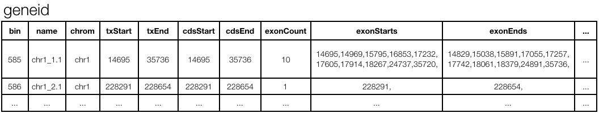

Query

    SELECT exonStarts
    FROM gene_id
    WHERE name = 'chr1_1.1';

Answer

    +------------------------------------------------------------------------------+
    | exonStarts                                                                   |
    +------------------------------------------------------------------------------+
    | 14695,14969,15795,16853,17232,17605,17914,18267,24737,35720, ...             |
    +------------------------------------------------------------------------------+

#### Star schema
Enables fast querying of data by minimizing joins (necessary in normalized schema)

2 attributes: (1) always 2 levels deep; (2) contains only one large table that is the focus of the model (**fact table**) + >1 **dimension tables**

database using star schema = reporting database (!= the authorative source of the data) => temporarily forget the rules of normalization

signals that you deviate from true star schema: (1) desire to retain the relationships between dimensions (= "snowflaking"); (2) existence of more than one fact table

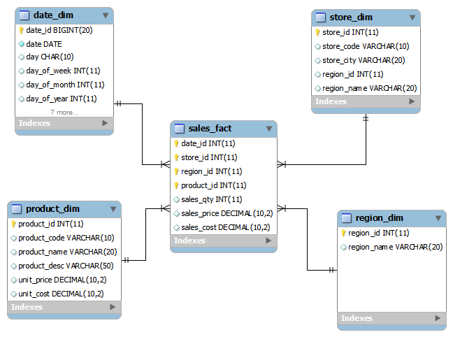

#### How did we go from relational to star schema?
Everything revolves around sales => base the fact table on the sale table (one row in fact table = one row in sale table)

Flattened the relationships all the way up the relational foreign key chain => keys in all reference tables become foreign keys in the fact table

Create dimensions for the data pointed to by each of the foreign keys

#### Exercise
Draw a database design to optimize analysis of the data stored in a database that looks like this:

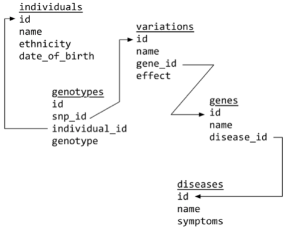

### 2. Writing scalability
Suppose you're writing a tool to store genomic variants as they are identified in a large number of .bam files into a relational database 
=> `Timeout error on inserting to database`

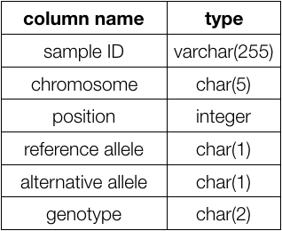

Solution 1: **queuing**

wasteful to only do a single insert at a time 
=> batch many inserts in a single request 
=> no timeous anymore (but queue will get longer)

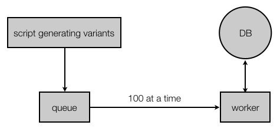

with even bigger loads: again bottleneck DB

Solution 2: **sharding**

use multiple database servers, each with a subset of the data (= "**horizontal partitioning**" or "**sharding**"); e.g.: 1 server per chromosome

but:
* your application code needs to know how to find the shard for each key
* when database too big again: split shards (e.g. p- vs q-arm, per Mb, ...)
* if so: need to update all application code that interacts with DB

General challenges concerning storage and writing:
* **fault-tolerance is hard**: as number of machines increases => higher chance that one of them goes down
* **complexity is pushed to application layer**: distributed nature of your data is not abstracted away from you (sharding)
* **lack of human fault-tolerance**: system must be carefully thought out to limit the damage a human mistake can cause
* **maintenance** is an enormous amount of work (re-sharding!)

## First principles of big data
Need to ask ourselves: "**At the most fundamental level, what does a data system do?**"

Data systems don't just memorize and regurgitate information. They combine bits and pieces together to produce answers.

Not all bits of information are equal: some is derived from other => what is the most raw form of information? (NGS sequencing data: bam? fastq? images?)

You answer questions on your data by running functions that take data as input. => **query = function(all data)** => goal of data system = compute arbitrary functions on arbitrary data

computational systems should be self-aware of their distributed nature => sharding, replication, ... are handled for you

data is **immutable** => when you make a mistake you might write bad data but at least you didn't destroy good data => human fault-tolerant

#### Data immutability
No more updates!

How to store the number of friends in a social graph?

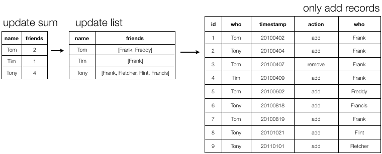

#### Desired properties of a Big Data system
**robust & fault-tolerant**: [1] system is complex (duplicated data, distributed data, concurrency, ...); [2] human fault-tolerant (deploying incorrect code that corrupts values in database)

**low latency** reads and updates

**scalable**: maintain performance with increasing data and/or load by just adding resources to the system

**general**

**extensible**: make it easy to do large-scale migrations

allows **ad hoc queries**

**minimal maintenance** = the work required to keep a system running smoothly
* => choose components that have a small *implementation complexity*: rely on simple algorithms and components
* common trick: push complexity out of the core components and into pieces of the system whose otuputs are discardable after a few hours (see later)

**debuggable**: be able to trace for each value in the system exactly what caused it to have that value

## Getting ready for exercises
**exercise server**: 54.93.45.232

**login name**: your last name, concatenated, no capitals (e.g. Miguel Castresana Aguirre -> `castresanaaguirre`)

**password**: exclamation mark + login name + your student number without the s (e.g. suppose my student number is s12345 -> `!aerts12345`)

to log in: `ssh castresanaaguirre@54.93.45.232`

#### Genome browser exercise
Most used online genome browsers:
* [Ensembl](http://www.ensembl.org)
* [UCSC](http://genome.ucsc.edu)

Ensembl

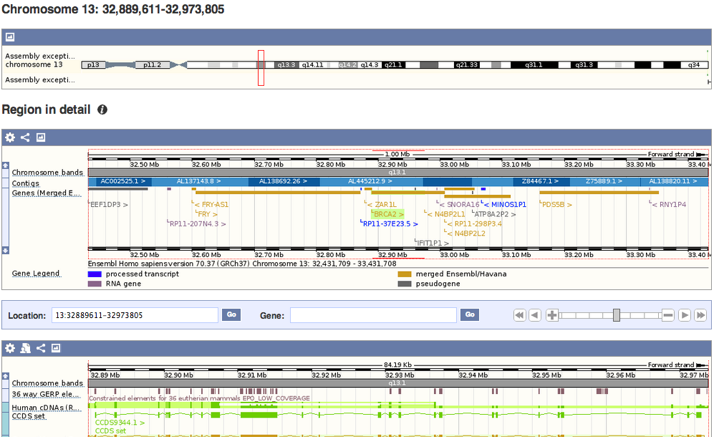

UCSC

#### Getting to the underlying genome browser data
Both databases use relational database underneath the browser:

Ensembl

    mysql -h ensembldb.ensembl.org -P 5306 -u anonymous homo_sapiens_core_70_37

UCSC

    mysql --user=genome --host=genome-mysql.cse.ucsc.edu -A hg19

#### Exercise: what's the main difference between the two?
* Log into the teaching server 54.93.45.232
* Log into the Ensembl database with mysql

<pre><code>SHOW TABLES;
SELECT * FROM gene LIMIT 2;
SELECT * FROM exon LIMIT 2;
SELECT * FROM transcript LIMIT 2;
SELECT * FROM exon_transcript LIMIT 2;</code></pre>

* Log into the UCSC database with mysql

<pre><code>SHOW TABLES;
SELECT * FROM refGene LIMIT 2;</code></pre>

What is different in the way they store the information?
