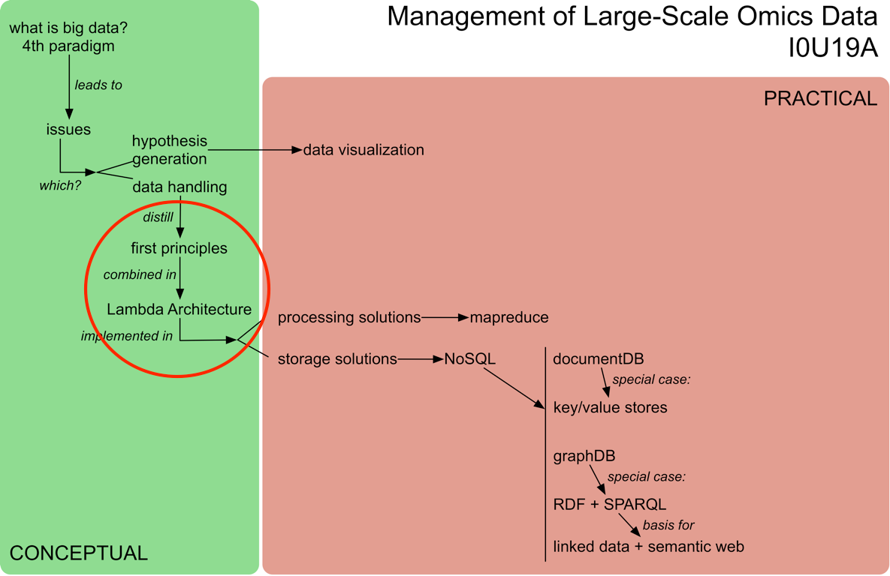
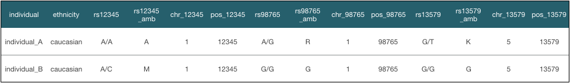
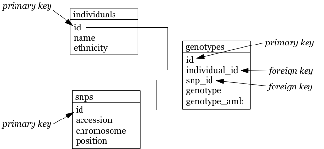
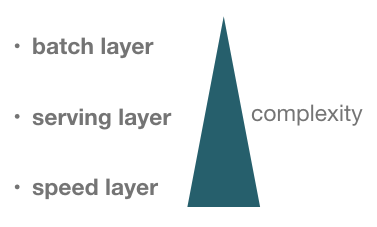
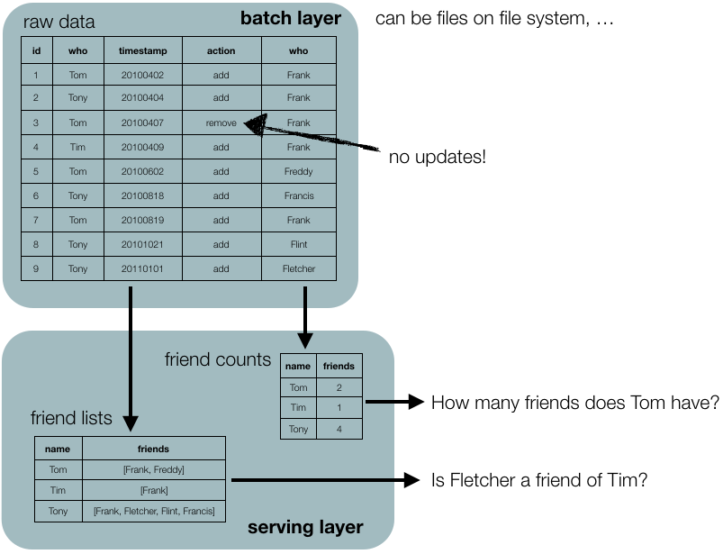
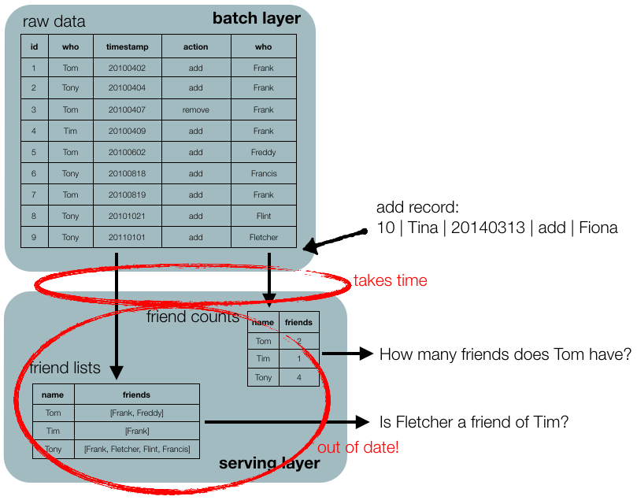
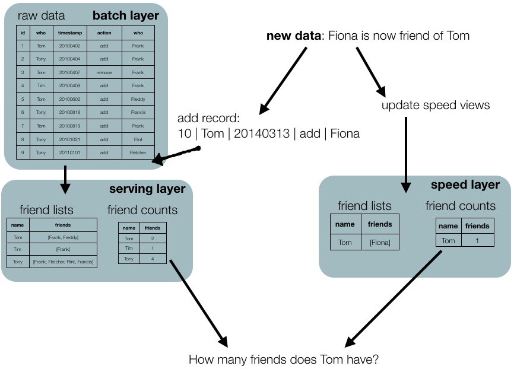
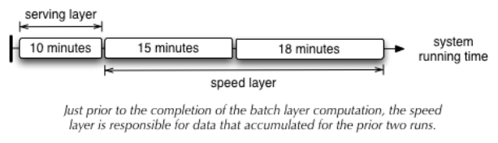
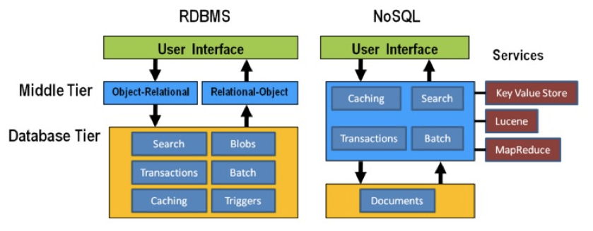
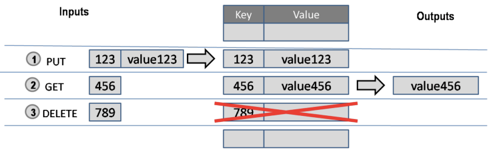

# I0U19A - Management of large-scale omics data
Prof Jan Aerts (jan.aerts@kuleuven.be) 
Visual Data Analysis Lab, STADIUS/ESAT, KU Leuven 
http://vda-lab.be/teaching/i0u19a

TA: Thomas Moerman (thomas.moerman@kuleuven.be)

today:
# Lambda Architecture

#### Batch vs real-time
Example Ensembl vs USCS database (1st lecture) showed that
* Ensembl database allows for wider diversity in queries, but is therefore slower
* UCSC database is optimized for speed (in a genome browser) but is less ideal for custom queries

Issue gets more prominent once we get to really large datasets => we need a system that can compute any query (**query = function(all data)**) but at the same time be fast enough to allow interactivity (low latency)

#### 3 layers in Lambda Architecture
No single tool can provide a complete solution => use a variety of tools and techniques to build a complete Big Data system

Lambda Architecture: decomposes the problem of computing arbitrary functions on arbitrary data in real time by decomposing it into 3 layers

 
<small>*Lambda Architecture diagram (from Big Data, Marz & Warren)*</small>

#### 1. Batch layer

needs to be able to (1) **store** an **immutable**, constantly growing **master dataset**, and (2) compute **arbitrary functions** on that dataset

"batch processing systems", e.g. Hadoop

continuously **recomputes** "views" that are exposed to the serving layer => "**batch views**"

very **simple**: computations are single-threaded programs, but automatically parallelize across a cluster => scales to datasets of any size

#### 2. Serving layer

load views from batch layer and make the queryable through indexing

together with batch layer: satisfy almost all properties we needs

only requires batch updates and random reads (does not need to support random writes)

#### Batch and serving layers satisfy almost all properties
* **robust & fault tolerant**: simple system; views can be recomputed; easily distributable
* **scalable**: can be implemented as fully distributed systems
* **general**: can compute and update arbitrary views of arbitrary data
* **extensible**: adding new view = adding new function on data
* **allows ad hoc queries**: batch view allows any function
* **minimal maintenance**: very few pieces
* **debuggable**: you alwyas have the inputs and outputs of computations run on the batch layer (<-> traditional DBs: you *update* the data)

#### 3. Speed layer

Serving layer updates whenever batch layer finishes precomputing views => the only data not represented in the batch views is the data that came in while the precomputation was running

=> only have to compensate for these last few minutes/hours of data

speed layer is similar to batch layer: produces views based on data it receives

 
Serving layer provides low-latency access to results of calculations performed on master dataset. Serving layer views are slightly out-of-date due to time required for batch computation.

Fundamentally different approach than batch and serving layers: **incremental updates** (<-> batch/serving: **recomputation updates**)

Consequence: significantly more complex! (because needs random reads and random writes)

Fortunately: narrow requirements => important **advantages**:
* speed layer is only responsible for data that is not yet included in serving layer => vastly **smaller dataset**
* speed layer views are transient => any **errors are short-lived**

**complexity isolation**: complexity is pushed into a layer whose results are only temporary

last piece of Lambda Architecture: merging results from serving and speed layer

#### How to compute real-time views
simple approach: same *recomputation* function as batch layer, but only on recent data => real-time view = function(recent data)

problem: will still have some latency => sub-second speed is difficult

=> we need *incremental algorithm*: does not need to constantly recompute when new data arrives

#### How to store real-time views
storage layer must meet these requirements:
* **random reads** - data must be indexed
* **random writes** - must be possible to modify a real-time view with low latency
* **scalability** - real-time views can be distributed across many machines
* **fault tolerance** - data must be replicated across machines in case one machine fails

#### Eventual accuracy
often very difficult to incrementally compute functions which are easily computed in batch (e.g. word count)

possible approach: **approximate** the correct answer
* will be continuously corrected through batch/serving
* common with sophisticated queries such as those requireing real-time machine learning

#### Asynchronous vs synchronous updates
**synchronous** update: application issues request directly to the database and **blocks** until the update is processed

=> update can be coordinated with other aspects of the application (e.g. displaying a spinning cursor while waiting for the update to complete)

**asynchronous** request: put in **queue**

impossible to coordinate with other actions since you cannot control when they are executed

but advantages: greatly increases throughput + can handle varying load more easily

#### How to choose between synchronous and asynchronous
synchronous update: typical for transactional systems that interact with users and require coordination with user interface

asynchronous update: typical for analytics-oriented workloads or workloads not requiring coordination

asynchronous is architecturally simpler => use asynchronous unless you have a good reason not to do so

#### How to expire real-time views
once batch computation run finishes: you can discard a portion of the speed layer views, but you need to keep everything else => what exactly needs to be expired?

suppose: just turned on application => no data 
=> when batch layer runs first: operates on no data 
=> if batch takes 10 minutes: when finished: batch views empty + 10min worth of data in speed

**2nd batch run** starts immediately after 1st

=> say 2nd run takes 15 minutes

=> when finished: batch view covers 1st 10 minutes + speed layer represents 25 minutes of data

=> first 10 minutes can be expired

**3rd batch run** starts immediately after 2nd

=> say 3rd run takes 18 minutes

=> prior to completion: speed layer responsible for data that accumulated in previous 2 runs

=> when 3rd run completes: data from 3 runs ago can be discarded

simplest way to do this: maintain *two* sets of real-time views and alternate clearing them after each batch run

=> after each batch layer run: application should switch to reading from the real-time view with more data

Speed layer allows Lambda Architecture to serve low-latency queries over up-to-date data

#### Understanding trade-offs in distributed systems
Using a formal process to understand the trade-offs in your selection process will help drive your focus towards things most important.

**Brewer's CAP theorem**: When a distributed data system is partitioned, it can consistent or available, but not both.

**_C_onsistency** (!= the consistency in ACID) - multiple clients reading the same items from **replicated partitions** get consistent results

**high _A_vailability** - knowing that the distributed database will always allow database clients to update items without delay (=> internal communication failures between replicated data should not prevent updates)

**_P_artition tolerance** - ability for the system to keep responding to client requests even if there is a communication failure between database partitions

CAP theorem only applies when something goes wrong in communication => the more reliable your network the less chance you need to think about CAP

CAP theorem helps you understand that once you partition your data you must consider the availability <-> consistency spectrum in case of network failure

## Data Processing in Lambda Architecture

batch systems: mapreduce
* very simple conceptually: map phase + reduce phase

real-time systems: spark, storm, ...
* technologically much more complex

see weeks 7 and 8

## Data Storage in Lambda Architecture

#### NoSQL - Not Only SQL
See weeks 9-11

= set of concepts that allow the rapid and efficient processing of datasets with a focus on performance, reliability and agility. Core themes:

free of joins

schema-free

works on many processors

uses shared-nothing commodity computers

supports linear scalability

#### NoSQL concepts
.1. **keeping components simple** to promote reuse: linux pipeline philosophy

NoSQL systems are often created by integrating a large number of modular functions that work together <=> traditional RDBMS: mammoth system 
`cat data.csv | grep "chr1" | cut -f 2 | sort | uniq -c`

e.g. one function allows sharing of objects in RAM, another function to run batch jobs, yet another function for storing documents

NoSQL system interfaces are broader than regular STDIN and STDOUT (i.e. using line delimiters): can be documents, REST, JSON, XML, ... services

.2. using **application tiers** to simplify design

by segregating an application into tiers you have the option of modifying or adding a specific layer instead of reworking an entire application => **separation of concerns**

user interface <-> middle tier <-> database layer

where do you put functionality? trade-offs

* RDBMS: have been along for long time and are mature => much functionality added to database tier
* NoSQL: most of application functionality is in middle tier

.3. speeding performance by **strategic use of RAM, SSD, and disk**

you: in Leuven
* getting something from RAM = your backyard
* getting something from SSD (solid state drive) = somewhere in your neighbourhood
* getting something from disk = traveling to Saudi Arabia
* getting something from the network = traveling to Jupiter

.4. using **consistent hashing** to keep your cache current

hash string or checksum = process that calculates sequence of letters by looking at each byte of a document (e.g. MD5, SHA-1)

consistent hashing: quickly tells you if a new query or document is the same as one already in your cache. Consistent hashing occurs when two different processes running on different nodes in your network create the same hash for the same object

changing a single bit in the object/file changes the MD5 sum

`md5sum my_file.txt => 5a13448726555d031061aef7432b45c3`

in principle: possible that 2 different documents create the same hash value = **hash collision**

MD5 algorithm: 128 bit string => occurs once every 10^38 documents => if you generate a billion documents a second it would take 10 trillion times the age of the universe for a single accidental collision to occur

consistent hashing: can also be used to assign documents to specific database nodes

.5. **ACID vs BASE** - two methods of reliable database transactions

ACID & BASE = "transaction control models"

RDBMS: ACID <-> NoSQL: BASE

example: bank transaction: making sure that the two processes in figure happen either together or not at all

**ACID**

* **Atomicity** - exchange of funds in example must happen as an all-or-nothing transaction
* **Consistency** - your database should never generate a report that shows a withdrawal from saving without the corresponding addition to the checking account => block all reporting during atomic operations (=> impact on speed!)
* **Isolation** - each part of the transaction occurs without knowledge of any other transaction
* **Durability** - once all aspects of transaction are complete, it's permanent

software to handle these rules = very complex (50-60% of the codebase => new databases often do not support database-level transaction management in their first release)

all transaction control strategies: depend on resource locking

ACID systems: focus on consistency and integrity of data above all other considerations (temporarily blocking reporting mechanisms is a reasonable compromise to ensure systems return reliable and accurate information) => *pessimistic*

**BASE**

* **Basic Availability** - information and service capability are “basically available” (you can always generate a report)
* **Soft-state** - some inaccuracy is temporarily allowed and data may change while being used to reduce the amount of consumed resources
* **Eventual consistency** - eventually, when all service logic is executed, the systems is left in a consistent state

e.g. shopping carts: no problem if back-end reports are inconsistent for a few minutes; it’s more important that the customer can actually purchase things

ACID: focuses on *consistency* <-> BASE: focuses on availability

BASE = *optimistic*: eventually all systems will catch up and be consistent

BASE systems tend to be much simpler and faster <= don't have to write code that deals with locking and unlocking resources

ACID vs BASE != black vs white; continuum

.6. **Horizontal scalability** through **database sharding**

In RDBMS: automatic sharding

As number of servers grows: higher chance that one will go down => duplicate data to backup or mirrored system = data **replication**

#### Types of NoSQL data stores

* **key/value stores**: simple data storage systems that use a key to access a value (e.g. image stores, Amazon S3)
* **document stores**: for storing hierarchical data structures (e.g. document search)
* **column stores**: sparse matrix systems that use a row and column as key
* **graph stores**: for relationship intensive problems (e.g. social network, gene network)

#### Key/value stores

very scalable: fast retrieval of values regardless of the number of items in your store

provide only a single way to access values (only commands: `put`, `get`, `delete`)

not possible to query value

very simple

very fast

simple database that when presented with a simple string (the key) returns an arbitrary large blog of data (the value)

don't have to specify data type for the value => you can store whatever you want

system stores the information as a blob (e.g. Amazon S3)

up to the application to determine what type of data it is and what to do with it

keys can be many things: path names to files, artificially generated strings, SQL queries (as string), ...

#### Using a key/value store
only 3 operations in API: `put`, `get` and `delete`

only 2 rules:
* **distinct keys**: you can never have two items with the same key
* **no queries on values**: you cannot select a key/value pair using the value 
<-> RDBMS: you can constrain a result set using the `WHERE` clause

#### Key/value use cases
* storing web pages:
  * key = URL; value = HTML code of webpage
* Amazon Simple Storage Service (S3)
  * uses a simple REST API (see later in course)
  * = key/value store, plus metadata and access control

#### Column stores

based on Google BigTable

database = multiple tables, each containing addressable rows, each row with a set of values in columns

important difference with RDBMS:

* each row can have a different set of columns (but common set of "column groups")
* tables are intended to have many (>1,000-1,000,000) columns

#### Graph stores

use **nodes**, **edges** and **properties** as primary elements

different underlying infrastructure
