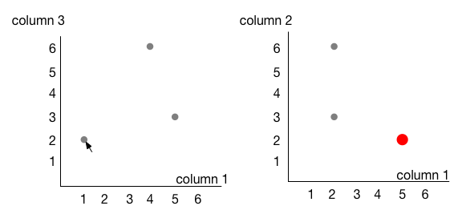

# Building a framework for modular data visualization

In this project, we want to build a framework to make data visualization simpler. Solutions like Tableau (www.tableau.com) exist, but lack a way to incorporate custom visuals (such as e.g. hive plots or sequence logo). The actual custom visualization is **not** the topic of this project (I only show these to indicate where we want to go with this in the future): it is really about building the framework to make these possible.

<br/>
<small><i>Hive plot</i></small>

<br/>
<small><i>Sequence logo</i></small>

## Web components
Web components make it possible to create custom HTML elements. The end "product" of this project should make it possible for someone to write an HTML file similar to this:

```html
<html>
<body>
  <csv data="my-data.csv" id="my-data"/>
  <scatterplot data="my-data" columns="1,3"/>
  <scatterplot data="my-data" columns="2,3"/>
</body>
</html>
```

This bit of HTML should draw 2 scatterplots on a website, where data is read from a local comma-separated file (called `my-data.csv`), and where one plot shows columns 1 and 3, where the other plot shows columns 2 and 3.

In addition, these plots should be _linked_, meaning that when I hover over a datapoint in the first plot, that the accompanying point in plot 2 is highlighted.

For example:

```
1,5,2
4,2,6
5,2,3
```

...would look like this. Notice how a point in the right plot is highlighted when the mouse hovers over a point in the left plot.

